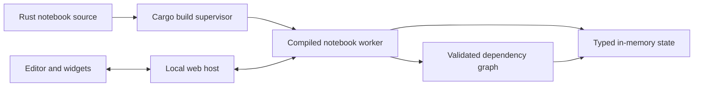

# Rustimo library design

Status: first reactive app slice implemented; editor and build supervisor are next.

## Product contract

Rustimo is a Rust library for reactive notebooks, with an optional CLI and web
editor. A notebook source file should be valid Rust. Running a cell invalidates
and recomputes only cells that consume its definitions. UI interaction updates
the signal and recomputes consumers without recompiling code. Duplicate names,
cycles, missing producers, and type mismatches are visible errors. Source order
controls presentation; the graph controls execution.

This adapts the contracts documented in [marimo's reactivity guide](https://docs.marimo.io/guides/reactivity/),
[interactive element guide](https://docs.marimo.io/guides/interactivity/), and
[notebook concepts](https://docs.marimo.io/getting_started/key_concepts/).
The same library is indexed by Context7 as `/marimo-team/marimo`.

## Assumptions

- Local, single-user development on stable Rust with a Cargo toolchain.
- Notebook code is trusted user code with filesystem access.
- Data can be larger than browser memory; values stay in the runtime process.
- CPU execution time and browser round-trip time are measured separately. No
  fixed microsecond latency is promised for arbitrary user computations.
- Source changes require a build; UI changes should not.

## Runtime architecture

The current slice combines host and worker in one process. On UI interaction,
it updates a `Ui<T>` held in the vault and invokes descendant functions in
topological order. Code changes in the next slice will compile a new worker,
retain the previous successful worker while compilation is pending, and swap
after a successful build. A failed build must leave old outputs clearly stale.
The worker boundary also contains aborts and native crashes from user code.

Every cell is a function with one result. Its function name is its definition;
its shared-reference parameter names are dependencies. `#[cell]` produces a
typed runner and metadata, while `notebook!(...)` explicitly registers cells.
The runtime validates the graph before executing it. `Arc<dyn Any + Send + Sync>`
owns results within one compiled worker, and generated runners downcast to the
declared input types. Browser views are serialized separately from large values.

## Decision log

| Decision | Alternative | Reason |
| --- | --- | --- |
| Explicit typed function inputs | Infer dependencies from arbitrary Rust statements | Rust's scopes, types, and macros make editor-side inference incomplete; signatures stay clear to the compiler. |
| One result per cell in the first version | Multiple implicitly exported names | A single producer name makes ownership and invalidation unambiguous. |
| Resident compiled worker | Recompile a script on every slider event | UI events can invoke already compiled cell functions. |
| Build the notebook with Cargo | `cdylib` hot reload per cell | A single worker avoids moving arbitrary Rust types across a dynamic library ABI boundary. |
| Cargo project first | Embedded-manifest standalone script | Cargo Script currently needs `-Zscript` on the installed stable toolchain. |
| Source order for display, DAG order for execution | Show cells only in topological order | Users can tell a story in the file while runtime follows dependencies. |

## Implementation path

1. **Reactive app slice — implemented.** Typed cells, graph checks, vault,
   slider, output views, local HTTP app, and tests for targeted invalidation.
2. **Editor and build supervisor.** `rustimo edit <notebook>`, source saving,
   Cargo JSON diagnostics mapped to cells, lazy/autorun mode, a separate worker
   process, and successful-build swaps.
3. **Notebook presentation.** Markdown cells, richer outputs, more typed UI
   inputs, and an app mode that hides source code.
4. **Data workflow.** Paged DataFrame views, Polars example using actual files,
   cancellation and resource limits for expensive cells.
5. **Portable source.** Support one `.rs` file through a CLI-generated Cargo
   project while keeping the source valid Rust and stable-toolchain compatible.

The next acceptance test should edit a cell in the browser, observe a successful
Cargo rebuild and targeted output refresh, then introduce a compiler error and
confirm that the old worker remains usable with outputs marked stale.
