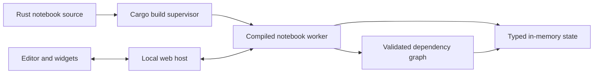

# Rustimo library design

Status: reactive runtime, local source editor, and cell-oriented notebook UI implemented.

## Product contract

Rustimo is a Rust library for reactive notebooks, with an optional CLI and web
editor. A notebook source file should be valid Rust. Running a cell invalidates
and recomputes only cells that consume its definitions. UI interaction updates
the signal and recomputes consumers without recompiling code. Duplicate names,
cycles, missing producers, and type mismatches are visible errors. Source order
controls presentation; the graph controls execution.

This adapts the contracts documented in [marimo's reactivity guide](https://docs.marimo.io/guides/reactivity/),
[interactive element guide](https://docs.marimo.io/guides/interactivity/), and
[notebook concepts](https://docs.marimo.io/getting_started/key_concepts/).
The same library is indexed by Context7 as `/marimo-team/marimo`.

## Assumptions

- Local, single-user development on stable Rust with a Cargo toolchain.
- Notebook code is trusted user code with filesystem access.
- Data can be larger than browser memory; values stay in the runtime process.
- CPU execution time and browser round-trip time are measured separately. No
  fixed microsecond latency is promised for arbitrary user computations.
- Source changes require a build; UI changes should not.

## Runtime architecture

The browser presents each `#[cell]` function as one editable code/output pair.
`syn` and `proc-macro2` locate top-level functions by byte spans, so saving one
cell changes only that region of the `.rs` file. Presentation follows file order;
the graph panel shows execution dependencies. Notebook mode shows source and
diagnostics, while app mode shows only outputs and interactive elements.

The editor runs as a host process, and the compiled notebook runs as a separate
worker executable. On UI interaction, the worker updates a `Ui<T>` in its vault
and invokes descendants in topological order. On source save, the host rebuilds
the example with Cargo, copies the executable to a unique worker path, checks
the new worker's HTTP state, replays compatible widget values, and swaps it in.
The previous worker remains available if compilation or startup fails; its
outputs are marked stale. The worker boundary also contains aborts and native
crashes from user code. The host currently serializes source rebuilds and UI
requests behind one mutex, so interactions wait while Cargo is running.
If the initial build fails, the host serves the source and diagnostics without
a worker so the notebook can be fixed in the browser.

Every cell is a function with one result. Its function name is its definition;
its shared-reference parameter names are dependencies. `#[cell]` produces a
typed runner and metadata, while `notebook!(...)` explicitly registers cells.
The runtime validates the graph before executing it. `Arc<dyn Any + Send + Sync>`
owns results within one compiled worker, and generated runners downcast to the
declared input types. Browser views are serialized separately from large values.

## Decision log

| Decision | Alternative | Reason |
| --- | --- | --- |
| Explicit typed function inputs | Infer dependencies from arbitrary Rust statements | Rust's scopes, types, and macros make editor-side inference incomplete; signatures stay clear to the compiler. |
| One result per cell in the first version | Multiple implicitly exported names | A single producer name makes ownership and invalidation unambiguous. |
| Resident compiled worker | Recompile a script on every slider event | UI events can invoke already compiled cell functions. |
| Build the notebook with Cargo | `cdylib` hot reload per cell | A single worker avoids moving arbitrary Rust types across a dynamic library ABI boundary. |
| Cargo project first | Embedded-manifest standalone script | Cargo Script currently needs `-Zscript` on the installed stable toolchain. |
| Source order for display, DAG order for execution | Show cells only in topological order | Users can tell a story in the file while runtime follows dependencies. |

## Implementation path

1. **Reactive app slice — implemented.** Typed cells, graph checks, vault,
   slider/text/checkbox widgets, output views, local HTTP app, and tests for targeted invalidation.
2. **Local editor and build supervisor — implemented for examples.**
   `rustimo edit crates/rustimo/examples/basic.rs`, source saving, Cargo JSON
   diagnostics with source locations, a separate worker, and successful-build
   swaps. Each new worker currently runs all cells before it is ready.
3. **Notebook presentation — initial slice implemented.** Per-cell editor,
   Markdown output, dependency panel, manual cell run, and an app mode that
   hides source code. Richer output types and editor commands remain open.
4. **Data workflow.** Paged DataFrame views, Polars example using actual files,
   cancellation and resource limits for expensive cells.
5. **Portable source.** Support one `.rs` file through a CLI-generated Cargo
   project while keeping the source valid Rust and stable-toolchain compatible.

The next slice should make Cargo builds asynchronous to keep UI interactions
responsive, preserve unaffected outputs when source changes, support stable
cell IDs across edits, and handle notebooks outside the built-in examples
directory. The current acceptance scenario was checked with a copied example:
a successful edit changed an output; a compiler error left the old worker and
slider usable with stale outputs; a successful fix replayed the slider value.

The [Pluto architecture comparison](PLUTO_ARCHITECTURE.md) separates mechanisms
that can be adapted directly from Julia-specific evaluation behavior and gives
acceptance checks for the next implementation slices.
