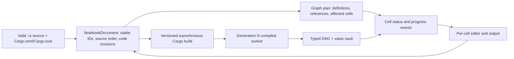

# What Rustimo can learn from Pluto.jl

Pluto is an explicit inspiration for [marimo](https://github.com/marimo-team/marimo#inspiration-).
Its most useful lesson for Rustimo is not Julia's dynamic evaluation, but the
separation of notebook source, dependency topology, execution state, and browser
state. This note compares [Pluto's architecture](https://plutojl.org/en/docs/architecture/)
with the current Rustimo prototype and defines the next implementation slices.

## Verified Pluto mechanisms

| Pluto mechanism | Evidence | Rustimo status |
| --- | --- | --- |
| Per-cell syntax analysis extracts definitions and references, then a separate notebook topology computes runnable order. | [ExpressionExplorer.jl](https://github.com/JuliaPluto/ExpressionExplorer.jl), [PlutoDependencyExplorer.jl](https://github.com/JuliaPluto/PlutoDependencyExplorer.jl) | Typed references are generated by `#[cell]`; `ReactiveGraph` builds a DAG. Source parsing is used only for the editor. |
| Rewriting a definition removes the old global; duplicate definitions are rejected. | [Reactivity](https://plutojl.org/en/docs/reactivity/) | A new Rustimo worker drops old values after a successful build, and duplicate cell names are errors. A failed build keeps the old worker but explicitly marks its outputs stale. |
| The displayed cell order can differ from topological execution order. | [Moving cells](https://plutojl.org/en/docs/moving-cells/) | Already true: source order drives display and the DAG drives execution. |
| Notebook files carry stable cell markers and package environment data. | [Notebook file](https://plutojl.org/en/docs/export-julia/), [package management](https://plutojl.org/en/docs/packages/) | `.rs` source is valid Rust, but function name currently doubles as cell identity; portable notebook packaging is still limited to Cargo examples. |
| Browser and server synchronize cell code, output, order, logs and progress through a shared state with patches. | [Architecture](https://plutojl.org/en/docs/architecture/), [public API](https://plutojl.org/en/docs/api/) | Rustimo currently sends full JSON snapshots after HTTP actions. Builds run off the host mutex; the browser polls revisioned build state, but has no per-cell progress stream. |
| User code runs in a separate process per notebook; disabled cells also disable dependents. | [Architecture](https://plutojl.org/en/docs/architecture/), [disabled cells](https://plutojl.org/en/docs/disable-cell/) | Separate worker exists. Runtime errors block descendants, but there is no explicit disable action yet. |

## Language boundary

Pluto can analyze Julia expressions, then evaluate changed cells in its live
notebook process. Rustimo uses compiled Rust functions and passes typed values
through `Arc<dyn Any + Send + Sync>` inside one executable. Replacing a function
in that executable requires compilation; arbitrary Rust values cannot be moved
into a new process merely because their producing cell did not change. Therefore
incremental *graph planning* and incremental *widget execution* are realistic
now; incremental *code execution after a source edit* requires a separate value
serialization contract or a different compilation/runtime model. Reusing a
previous browser output is only a stale preview, never proof that the new worker
has a current typed value.

We should keep function signatures as the authoritative dependency declaration.
Inferring producers and consumers from arbitrary Rust identifiers would need
compiler name resolution and macro expansion, not just a `syn` parse. Pluto's
own [expression analysis](https://github.com/JuliaPluto/ExpressionExplorer.jl#macro-calls)
has to defer macro arguments until expansion because macros can change what is
defined or referenced. Rust macros make the same problem acute. The editor may
inspect syntax for diagnostics and visualization, but compiled descriptors must
remain the source of truth for execution.

## Recommended model

`NotebookDocument` belongs in the editor host. Each cell should have a stable
`CellId`, a current function name, source range, source-order position, code
revision/hash, and enabled flag. The function name remains a DAG definition;
the ID identifies the cell in the UI, bookmarks and edits across renames. A
source marker adjacent to `#[cell]` can persist IDs while keeping the file
valid Rust. It must move together with the function when cells are reordered.
Existing notebooks can initially migrate by assigning IDs once, then keeping
them stable. Two cells with the same marker must be diagnosed rather than
silently merged.

The host should compare old and new compiled topology for each source revision
and report which cells are affected. The worker remains the authority for
typed execution and output. Every response/event should include both document
revision and worker generation so the browser never applies an old build or
signal response to a newer notebook. Source edits can immediately show queued
or stale cells; a successful new worker publishes current outputs atomically.

For a local single-user editor, HTTP mutations plus server-sent events are a
reasonable first step for live progress. Pluto uses WebSocket and MsgPack to
support synchronized clients, but Rustimo does not need that complexity before
multi-client editing. Build jobs should run outside the editor's state mutex:
the active worker can still process widgets while Cargo runs, with its output
visibly marked as belonging to the older generation. Superseded build jobs
must not replace a newer successful worker.

Disabling a cell should invalidate its stored value and block all descendants,
matching [Pluto's rule](https://plutojl.org/en/docs/disable-cell/) and Rustimo's
existing error propagation. The browser should distinguish `disabled`,
`blocked`, `queued`, `running`, `success`, `error`, and `stale` states. A disabled
cell may still compile as part of the Rust program; the runtime must skip its
runner and cannot let consumers read its previous value.

For reproducibility, Rustimo should use Rust's native project files:
`Cargo.toml`, `Cargo.lock`, and a valid `.rs` notebook. Pluto embeds Julia's
Project/Manifest contents inside `.jl`; copying that packaging literally would
fight Cargo's existing model. A future portable-notebook CLI can generate a
small Cargo project next to a standalone source file, with pinned dependencies.

## Implementation order and acceptance checks

1. **Responsive build supervisor — polling slice implemented.** Cargo runs off
   the host lock. Source revision and worker generation guard replacement;
   during a slow build, a slider updates the old worker with stale-marked output.
   Revision B supersedes A. Evented build and per-cell progress remain open.
2. **Stable cell identity.** Persist IDs in valid `.rs` source and key drafts,
   bookmarks and status by ID. Renaming `data` should preserve its cell in the
   UI while dependencies use the new function name. Duplicate IDs must fail.
3. **Explicit disabled state.** Disable a producer, clear its value and block
   descendants; re-enable and rerun in topological order. No old value may be
   visible as current or available through `Notebook::get`.
4. **Portable Cargo notebook.** Open a `.rs` file outside built-in examples,
   generate/use a locked Cargo project, and verify the same source can be built
   from a clean checkout.
5. **Richer display protocol.** Add typed table/image/structured-data views
   before introducing arbitrary HTML. Views should be small projections of
   values; large Rust objects remain in the worker and are fetched by page.

The remaining work fixes the largest architectural gap with Pluto: Rustimo has
build status but no detailed execution progress or stable identity while source
changes. Revisioned state prepares the browser for later multi-client
synchronization without committing to Pluto's exact frontend transport.
